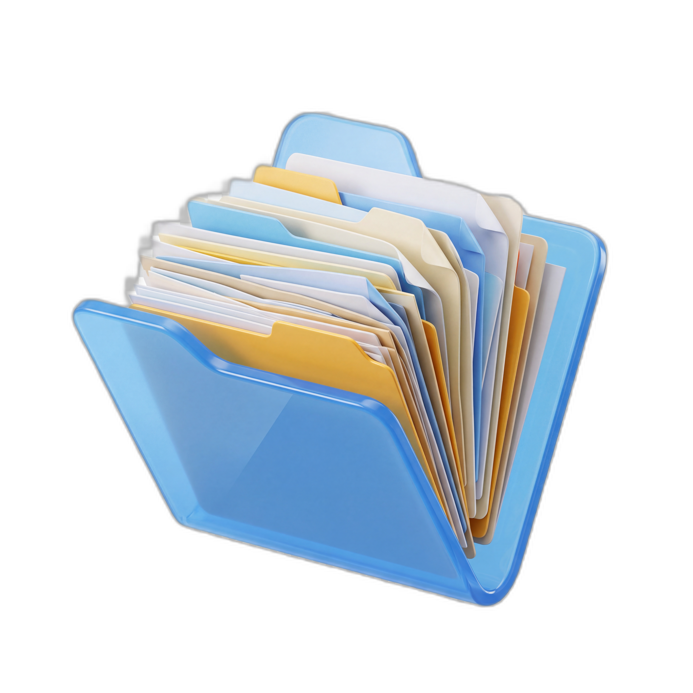
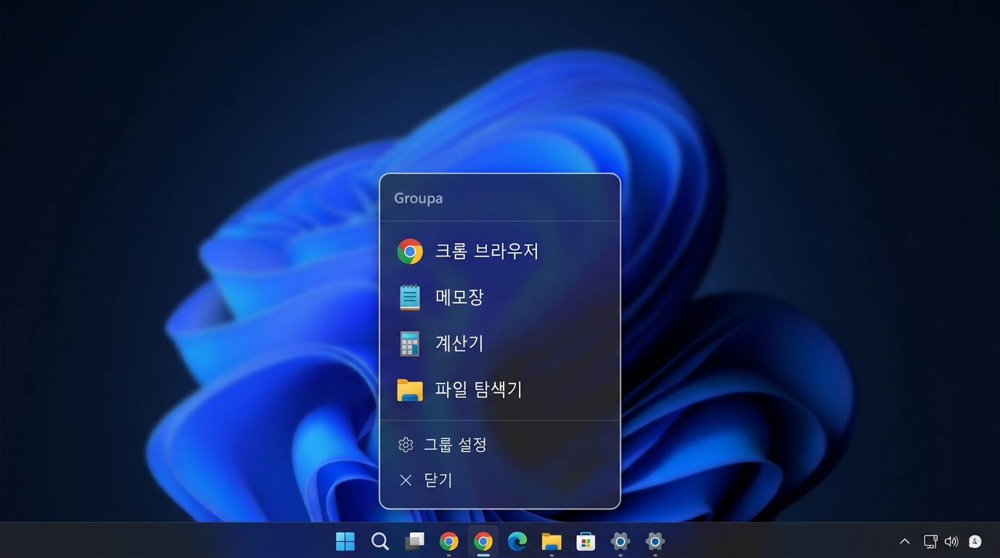
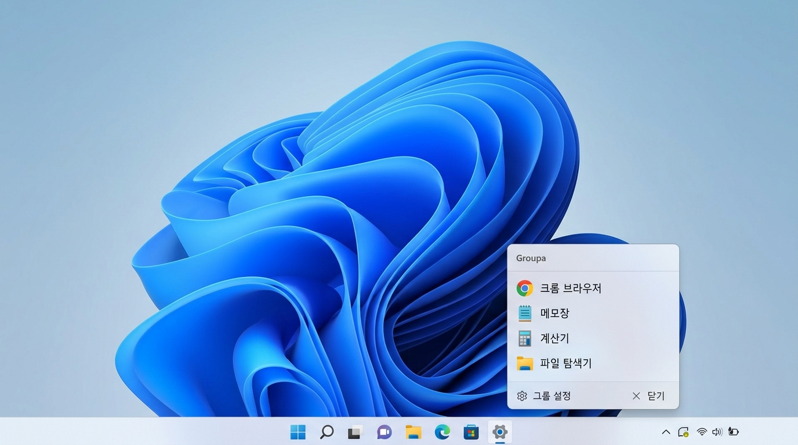

# Groupa

<p align="center">
  <a href="README_kor.md">한국어</a> | <b>English</b>
</p>

<p align="center">
  
</p>

<p align="center">
  <b>Windows Taskbar Quick Launcher</b>
</p>

<p align="center">
  
  
  
</p>

---

Pin it to your taskbar — click to pop up a list of your favorite apps, just like a jump list.

## Features
- Popup appears right above the taskbar icon
- Automatically follows Windows dark/light mode
- Auto-detects OS display language (English / 한국어)
- Single exe (~1MB), no installation required
- Built-in settings editor to add, remove, and reorder apps

## Screenshots

| Dark Mode | Light Mode |
|:---------:|:----------:|
|  |  |

## Installation
**Requirements**
- Windows 10 or later (64-bit)

**Download**
1. Download the latest version from [Releases](https://github.com/Oh-JongJin/Groupa/releases)
2. Extract to any folder
3. Run `Groupa.exe`
4. Pin to taskbar for quick access

## Build from Source
```bash
git clone https://github.com/Oh-JongJin/Groupa.git
cd Groupa
dotnet publish -c Release -r win-x64
```

Output: `bin/Release/net8.0-windows/win-x64/publish/Groupa.exe`

## Configuration
Apps are stored in `config.json` (auto-generated on first run):

```json
{
  "group_name": "Groupa",
  "apps": [
    { "name": "", "path": "C:\\Windows\\System32\\notepad.exe" },
    { "name": "", "path": "calc.exe" },
    { "name": "", "path": "C:\\Windows\\explorer.exe" }
  ]
}
```

- `name` — Leave empty for auto-detection (follows OS language), or set a custom name
- `path` — Full path or filename (searches PATH automatically)

## Tech Stack
- .NET 8.0 / WPF
- Windows 11 Fluent Design (Mica backdrop, rounded corners)
- Shell32 `SHGetFileInfoW` for icon extraction
- UI Automation API for taskbar detection
- DWM `DwmSetWindowAttribute` for theme switching

## License
MIT License
