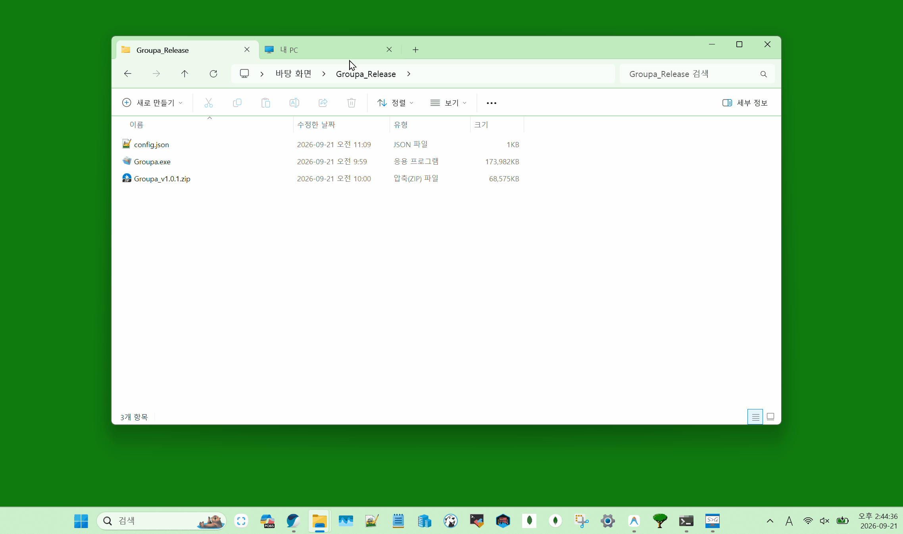

# Groupa

<p align="center">
  <b>한국어</b> | <a href="README.md">English</a>
</p>

<p align="center">
  
</p>

<p align="center">
  <b>Windows 작업 표시줄 퀵 런처</b>
</p>

<p align="center">
  
  
  
</p>

---

작업 표시줄에 고정해두고, 클릭하면 자주 쓰는 앱 목록이 점프 리스트처럼 팝업으로 뜹니다.

## Demo


## Features
- 작업 표시줄 아이콘 바로 위에 팝업이 표시됨
- Windows 다크/라이트 모드 자동 감지
- OS 표시 언어에 따라 한국어/영어 자동 전환
- 단일 exe (~1MB), 별도 설치 불필요
- GUI 설정 에디터로 앱 추가/삭제/정렬 가능


## Installation
**요구 사항**
- Windows 10 ~ (64비트)

**사용 방법**
1. [Releases](https://github.com/Oh-JongJin/Groupa/releases) 페이지에서 최신 버전 다운로드
2. 원하는 폴더에 압축 해제
3. `Groupa.exe` 파일을 작업 표시줄로 이동
4. 작업 표시줄에서 클릭하여 사용

## Build from Source
```bash
git clone https://github.com/Oh-JongJin/Groupa.git
cd Groupa
dotnet publish -c Release -r win-x64
```

출력 경로: `bin/Release/net8.0-windows/win-x64/publish/Groupa.exe`

## Configuration
앱 목록은 `config.json`에 저장됩니다 (첫 실행 시 자동 생성):

```json
{
  "group_name": "Groupa",
  "apps": [
    { "name": "", "path": "C:\\Windows\\System32\\notepad.exe" },
    { "name": "", "path": "calc.exe" },
    { "name": "", "path": "C:\\Windows\\explorer.exe" }
  ]
}
```

- `name` — 비워두면 OS 언어에 맞게 자동 감지, 직접 입력하면 커스텀 이름 사용
- `path` — 전체 경로 또는 파일명 (PATH 자동 검색)

## Tech Stack
- .NET 8.0 / WPF
- Windows 11 Fluent Design (Mica 배경, 둥근 모서리)
- Shell32 `SHGetFileInfoW` 아이콘 추출
- UI Automation API 작업 표시줄 감지
- DWM `DwmSetWindowAttribute` 테마 전환

## License
MIT License